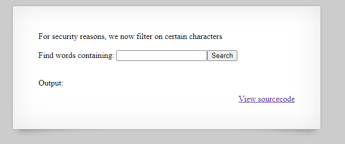
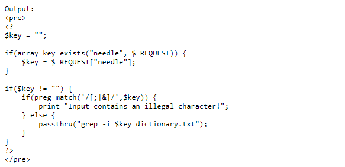
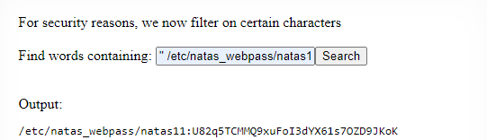

# Natas 10

Link : http://natas10.natas.labs.overthewire.org/

Natas 10 screen :

Natas 10 source code :

[;|&] :

Match a single character present in the list below [;|&]
;|& matches a single character in the list ;|& (case sensitive)

So for that reason we have to change the payload excluding the (;) now the payload is ('' /etc/natas_webpass/natas11)

So the password for Natas 11 is : U82q5TCMMQ9xuFoI3dYX61s7OZD9JKoK