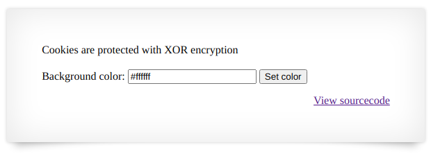

# Natas 11

Link : http://natas11.natas.labs.overthewire.org/

Natas 11 screen :




Natas 11 source code :


```php
$defaultdata = array( "showpassword"=>"no", "bgcolor"=>"#ffffff");
$cookie = "ClVLIh4ASCsCBE8lAxMacFMZV2hdVVotEhhUJQNVAmhSEV4sFxFeaAw=";

function xor_encrypt($in, $defaultdata) {
    $key = $defaultdata;
    $text = $in;
    $outText = '';
  
    // Iterate through each character
    for($i=0;$i<strlen($text);$i++) {
        $outText .= $text[$i] ^ $key[$i % strlen($key)];
    }

    return $outText;
}

echo xor_encrypt(base64_decode($cookie), json_encode($defaultdata));
//output qw8Jqw8Jqw8Jqw8Jqw8Jqw8Jqw8Jqw8Jqw8Jqw8Jqw8Jqw8Jq
```
```php
echo "
";
$data = array( "showpassword"=>"yes", "bgcolor"=>"#ffffff");  
$data1='qw8Jqw8Jqw8Jqw8Jqw8Jqw8Jqw8Jqw8Jqw8Jqw8Jqw8Jqw8Jq';
echo base64_encode(xor_encrypt(json_encode($data),$data1)); 
// output : ClVLIh4ASCsCBE8lAxMacFMOXTlTWxooFhRXJh4FGnBTVF4sFxFeLFMK
```
Then change the value of the cookie with ClVLIh4ASCsCBE8lAxMacFMOXTlTWxooFhRXJh4FGnBTVF4sFxFeLFMK


So the password for Natas 11 is : EDXp0pS26wLKHZy1rDBPUZk0RKfLGIR3