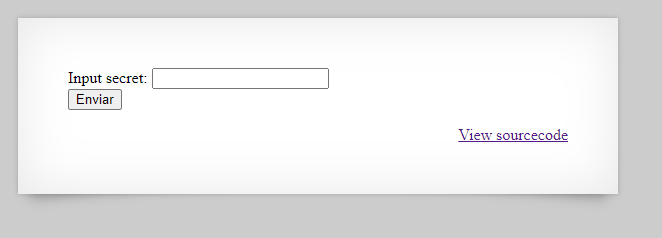
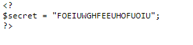

# Natas 6

Link : http://natas6.natas.labs.overthewire.org/

Natas 6 screen :



Clicking in View sourcecode , you redirect to :


```php
include "includes/secret.inc";

    if(array_key_exists("submit", $_POST)) {
        if($secret == $_POST['secret']) {
        print "Access granted. The password for natas7 is <censored>";
    } else {
        print "Wrong secret";
    }
    }
```
The code is recieving a file from "includes/secret.inc", if we access to 

http://natas6.natas.labs.overthewire.org/includes/secret.inc 



Now our secret is "FOEIUWGHFEEUHOFUOIU".


So the password for Natas7 is : 7z3hEENjQtflzgnT29q7wAvMNfZdh0i9