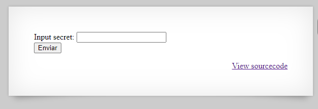
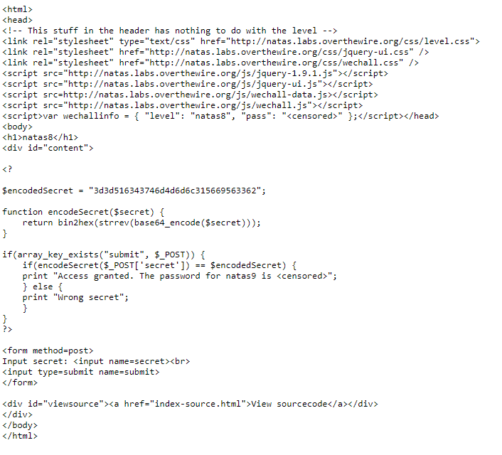
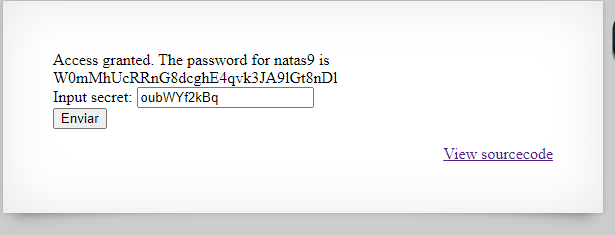

# Natas 8

Link : http://natas8.natas.labs.overthewire.org/

Natas 8 screen :



Natas 8 source code :



```php
$encodedSecret = "3d3d516343746d4d6d6c315669563362";

function encodeSecret($secret) {
    return bin2hex(strrev(base64_encode($secret)));
}

```
Now , we have to get the $secret using the function encodeSecret() and $encodedSecret 

```php

function decodedSecret($encodedSecret){
    return base64_decode(((strrev(hex2bin($encodedSecret)))));
}
```
From decodedSecret() we get $secret = oubWYf2kBq



So the password for Natas1 is : W0mMhUcRRnG8dcghE4qvk3JA9lGt8nDl